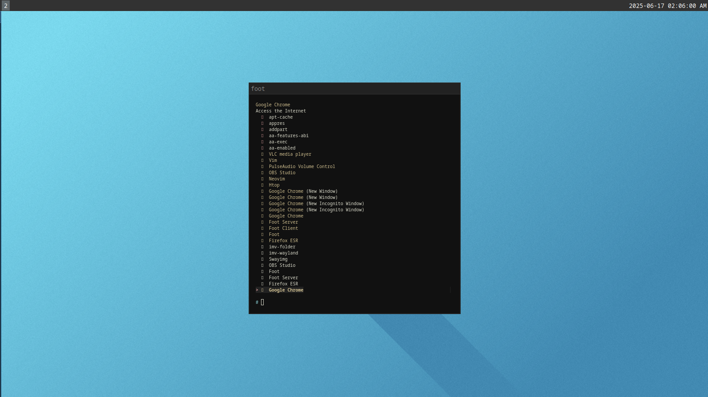

# Sway configuration using Debian (minimum possible installation)

## Status Bar using i3Blocks

#### Requirements
`i3blocks` packages

## Launcher
Using [Sway Launcher Desktop](https://github.com/Biont/sway-launcher-desktop)

#### Requirements 
`fzf` `gawk` packages

## Screen Capture
Captures screen and copies to clipboard

#### Requirements 
`grim` `slurp` `wl-clipboard` packages and `~/Pictures` folder

### Capture Selected Area 
use `PrintScreen` key to do this action

### Capture entire screens (all monitors"
use `$mod+Shift+PrintScreen` key to do this action
